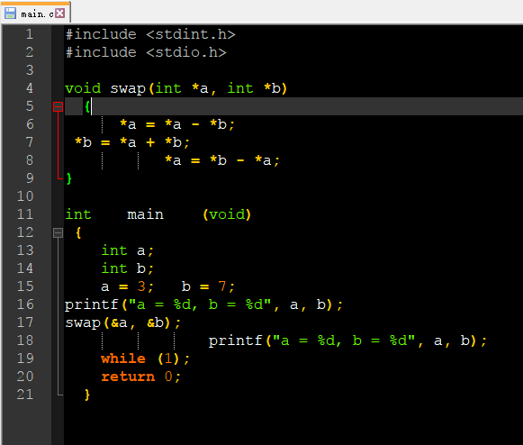
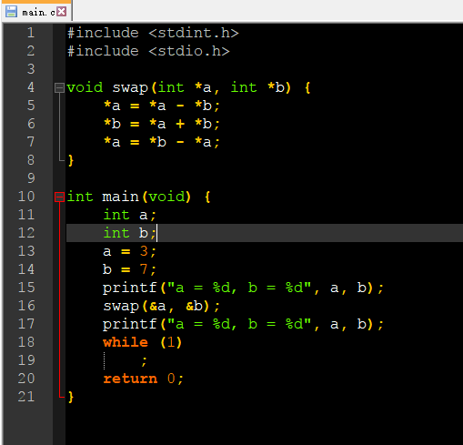

# CodeFormat

## 0x00 : Format your code with [Clang-Format](http://clang.llvm.org/docs/ClangFormat.html)

* Clang-format is a part of Clang, [Clang-Wikipedia](https://en.wikipedia.org/wiki/Clang).
* Clang-format can be used to format C/C++/Obj-C code.
* Before we use Clang-format:

* After we used Clang-format:

## 0x01 : For windows
1. [Download Clang](http://releases.llvm.org/download.html), choose from __Pre-Built Binaries__.
2. Install Clang.
3. Add environment variables : C:\Program Files\LLVM\bin, restart your PC.
4. Open a terminal, input "clang-format -help", make sure environment variables has been added successfully.
5. Download clang-format_en.bat(english) or clang-format_ch.bat(chinese).
6. Copy clang-format_xx.bat to your project directory.
7. Before format your code, please make a backup of your code!!! 
8. Double click clang-format_xx.bat to run, this clang-format_xx.bat script will format all the __.c__ __.cpp__ __.h__ __.hpp__ code recursively.
9. You can also modify the script to support other programing language, choose a [coding style](http://clang.llvm.org/docs/ClangFormatStyleOptions.html) and so on..

## 0x02 : For linux
